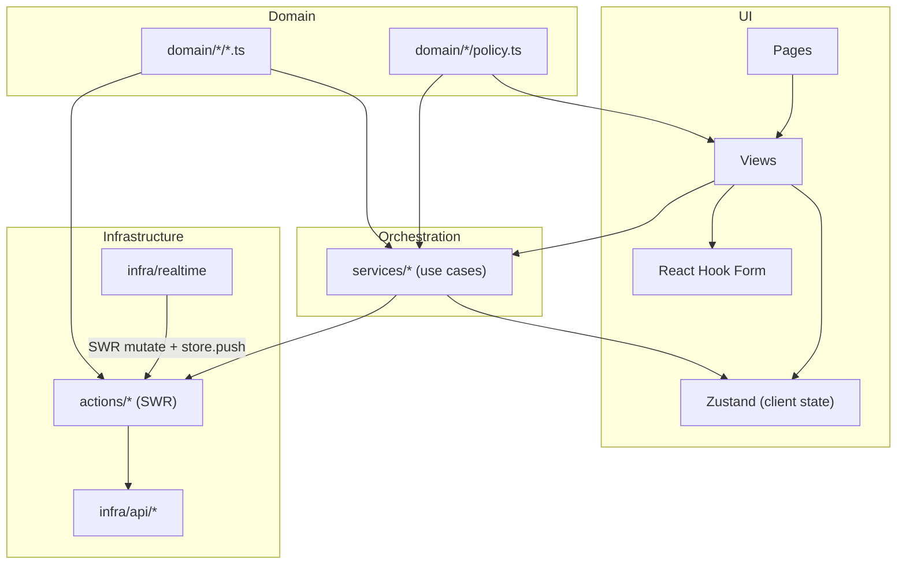

# Architecture

```
src/
  pages/           thin route pages, lazy-loaded
  sections/        feature UI (list/details/forms/views)
  components/      primitive + cross-feature UI bits
  layouts/         shell, nav, header
  routes/          react-router config + guards
  auth/            AuthProvider, hooks, guards, roles, permissions
  hooks/           reusable local-state hooks
  store/           Zustand stores (client UI state)
  services/        orchestration layer (multi-step use cases)
  domain/          pure entities, zod schemas, policies, selectors
  infra/
    api/           HTTP adapters (axios today, swap-friendly)
    realtime/      WS/mock adapter + topic registry
  actions/         SWR hooks (server cache)
  utils/           low-level helpers
  _mock/           demo data
  theme/           MUI theme
```

## Layered data flow



## Who owns what

| Concern                               | Owner                         |
| ------------------------------------- | ----------------------------- |
| Server cache + retries + revalidation | SWR hooks in `actions/*`      |
| Forms                                 | React Hook Form + zod         |
| Auth session + role                   | `AuthContext` via `AuthProvider` |
| Theme, color mode, nav layout         | `SettingsContext`             |
| Cross-component UI state              | Zustand stores in `store/`    |
| Multi-step business flows             | `services/*`                  |
| Shapes + business rules               | `domain/*`                    |
| HTTP transport                        | `infra/api/*`                 |
| WebSocket / SSE                       | `infra/realtime/*`            |

## Patterns and rules

- Do not mix layers. Components call services; services call actions; actions
  call api adapters. Realtime adapters push into SWR via `mutate`.
- Policies are the single source of truth for "can X do Y to Z". Views use
  `<Can perm="...">` for coarse gates and `<Can policy={P.canEdit} subject={row}>`
  for instance-level decisions.
- Do not duplicate server data in Zustand. SWR is already a cache.
- Views should not reach into `localStorage`, `sessionStorage`, or `window`
  directly - use `store/ui-preferences-store.ts` or `store/dev-store.ts`.
- Realtime is for invalidation, not for stateful replacement of the cache.

See also: [`src/store/README.md`](../src/store/README.md) and
[`src/domain/README.md`](../src/domain/README.md).

## Role-based access

Roles live in `src/auth/roles.ts`, permissions in `src/auth/permissions.ts`.
Route-level guards are applied in `src/routes/sections/dashboard.tsx` via
`<RoleGuard>`. Each view gates inline actions with `<Can>`. See
[`docs/rbac.md`](./rbac.md) for details (if/when it is added).

## Realtime

Configured by `CONFIG.realtime.driver` (`mock | ws | disabled`) in
`src/config-global.ts`. Defaults come from `.env`:

```
VITE_REALTIME_DRIVER=mock
VITE_REALTIME_URL=
```

Events are dispatched through `src/infra/realtime/registry.ts`, which is the
one place that maps an event topic to an SWR cache key or a store mutation.
